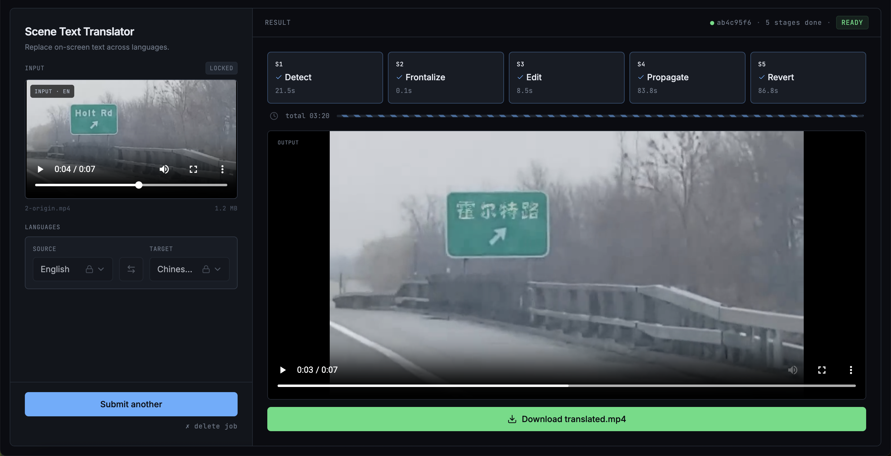

# Cross-Language Scene Text Replacement in Video

Automatically translate scene text in video frames, preserving font style, perspective, and lighting consistency.

## Demo

<p align="center">
  <video src="https://github.com/user-attachments/assets/d350ff7c-f3fc-4bfb-95c4-541a5c12cfed" controls autoplay loop muted playsinline width="80%"></video>
</p>

## Environment Setup

### Prerequisites
- Conda (Miniconda, Miniforge, or Anaconda)
- NVIDIA GPU with CUDA 12.x driver (`nvidia-smi` to verify)
- AnyText2 Gradio server running (managed separately — see below)

### 1. Create conda environment

```bash
conda create -n vc_final python=3.11 -y
conda activate vc_final
```

### 2. Install base dependencies + PyTorch + EasyOCR

Two convenience requirements files bundle base deps + `torch` + `easyocr`:

```bash
cd code
pip install -r requirements/gpu.txt    # GPU (default CUDA index: cu130)
# OR
pip install -r requirements/cpu.txt    # CPU-only
```

**CUDA index mismatch** — `requirements/gpu.txt` pins the PyTorch wheel index to `cu130` by default. Check your driver with `nvidia-smi`:

| Driver CUDA | PyTorch index |
|-------------|---------------|
| 12.4–12.8   | `cu124`       |
| 13.0+       | `cu130`       |

If your driver is on the 12.x line, install base + torch + easyocr separately instead:

```bash
cd code
pip install -r requirements/base.txt
pip install torch torchvision --index-url https://download.pytorch.org/whl/cu124
pip install easyocr
```

Verify: `python -c "import torch; print(torch.cuda.is_available())"`

### 3. Install PaddlePaddle + PaddleOCR

PaddlePaddle GPU must also match your CUDA driver:

| Driver CUDA | PaddlePaddle index |
|-------------|-------------------|
| 12.4–12.8   | `cu126`           |
| 13.0+       | `cu130`           |

```bash
# Example for CUDA 12.4–12.8:
pip install paddlepaddle-gpu==3.3.0 -i https://www.paddlepaddle.org.cn/packages/stable/cu126/
pip install paddleocr
```

> **Gotcha:** PaddlePaddle GPU built for CUDA 13.0 will silently fall back to CPU on a 12.x driver, then crash with a OneDNN `NotImplementedError`. Always match the CUDA index to your driver.

### 4. Install CoTracker

```bash
cd third_party
git clone https://github.com/facebookresearch/co-tracker.git
cd co-tracker
pip install -e .

# Download checkpoints
mkdir -p checkpoints && cd checkpoints
wget https://huggingface.co/facebook/cotracker3/resolve/main/scaled_offline.pth
wget https://huggingface.co/facebook/cotracker3/resolve/main/scaled_online.pth
cd ../../..
```

### 5. Install gradio_client (for AnyText2)

```bash
pip install "gradio_client>=1.5.0"
```

### 6. Install SRNet (background inpainter for LCM)

SRNet provides the background inpainting subnetwork used by the Lighting Correction Module (LCM) in S4. The install script clones the repo and downloads the pretrained checkpoint (~88 MB) via `gdown`.

```bash
pip install gdown
cd third_party
bash install_srnet.sh
cd ..
```

This creates `third_party/SRNet/` with the checkpoint at `third_party/SRNet/checkpoints/trained_final_5M_.model`.

> **Note:** Only the background inpainting subnetwork (`_bin`) is used — SRNet's other dependencies are not required.

### 7. Download BPN checkpoint (blur prediction)

The Blur Prediction Network (BPN) predicts per-frame differential blur to match each target frame's sharpness. Download the pretrained checkpoint (~136 MB):

```bash
# From repo root:
bash checkpoints/download.sh
```

This creates `checkpoints/bpn/bpn_v0.pt`. Alternatively, download manually from [Google Drive](https://drive.google.com/file/d/1ZUDMCDw6tJka-0Dxkhev2bRvkkLMcKpv/view?usp=drive_link) and place it in `checkpoints/bpn/`.

### 8. AnyText2 server

AnyText2 runs in a **separate** conda env (Python 3.10) to avoid dependency conflicts.
See [`third_party/install_anytext2.sh`](third_party/install_anytext2.sh) for setup instructions.

Once the server is running, set the URL in your config YAML:

```yaml
text_editor:
  backend: "anytext2"
  server_url: "http://<host>:<port>/"
```

### Quick verification

```bash
conda activate vc_final
cd code

# Unit + integration tests (no GPU/server required)
python -m pytest tests/ -v

# Lint
ruff check .

# Full end-to-end (requires GPU + AnyText2 server + test video)
python -m pytest tests/e2e/ -v
```

## Usage

```bash
# Activate conda environment
conda activate vc_final
cd code

# Run the pipeline (advanced config: CoTracker + PaddleOCR + AnyText2)
PADDLE_PDX_DISABLE_MODEL_SOURCE_CHECK=True python scripts/run_pipeline.py \
  --config config/adv.yaml \
  --input <video> --output <out> \
  --source-lang en --target-lang es

# Run with default config (Farneback + EasyOCR + placeholder editor)
python scripts/run_pipeline.py --input <video> --output <out> --source-lang en --target-lang es

# Run tests
python -m pytest tests/ -v

# Lint
ruff check .
```

## Web Application

<p align="center">
  
</p>

Browser-based UI for the same pipeline — upload a video, pick source/target
languages, watch per-stage progress and live logs, download the result.
FastAPI + React, single process, in-memory job queue. Source under `server/`
(backend) and `web/` (frontend). See
[`docs/architecture.md`](docs/architecture.md#web-application) for design.

### Extra prerequisites
- Node 20+ and npm (for the frontend bundle).
- `ffmpeg` on PATH (for browser-safe MP4 transcode after the pipeline runs).

### Install
```bash
# Backend deps (into the same vc_final env)
pip install -r server/requirements.txt

# Frontend deps
cd web && npm install && cd ..
```

### Dev mode (hot-reload)
```bash
./server/scripts/dev.sh
# uvicorn --reload on :8000, Vite on :5173 (proxies /api → :8000)
# browse http://localhost:5173/
```

### Prod / demo mode (single port)
```bash
./server/scripts/build_frontend.sh
# → builds web/dist, copies into server/app/static/
python -m uvicorn server.app.main:app --host 0.0.0.0 --port 8000
# browse http://localhost:8000/  (SPA + /api/* on the same origin)
```

### Tests
```bash
cd server && python -m pytest tests/ -v          # 87 default tests
cd server && python -m pytest tests/ -v -m gpu   # 3 real-pipeline integration tests (requires GPU + AnyText2)
cd web && npm run test                            # 147 frontend tests
```

## Architecture

### Pipeline Overview

The pipeline follows STRIVE's frontalization-first design: all ROIs are warped to a canonical frontal rectangle before editing and propagation, then warped back to the original perspective for compositing.

```
Video Frames
     |
     v
S1: Detection + Tracking + Selection
     |  list[TextTrack]  (dense detections, reference selected)
     v
S2: Frontalization
     |  list[TextTrack]  (H_to_frontal / H_from_frontal on each detection)
     v
S3: Text Editing
     |  list[TextTrack]  (edited_roi in canonical frontal space)
     v
S4: Propagation
     |  dict[frame_idx, list[PropagatedROI]]  (lighting-adapted, alpha-masked)
     v
S5: Revert
     |  list[np.ndarray]  (final output frames)
     v
Output Video
```

### Key Data Types

These dataclasses flow through the pipeline. Each stage reads and enriches them. All defined in [`code/src/data_types.py`](code/src/data_types.py).

#### BBox
Axis-aligned bounding box. Fields: `x`, `y`, `width`, `height`. Provides `to_slice()` for numpy array indexing and `area()`. Derived from `Quad` via `quad.to_bbox()` — used for fast IoU matching and array cropping where perspective accuracy isn't needed.

#### Quad
Four corner points defining a text region polygon. `points: np.ndarray` of shape `(4, 2)` in `[TL, TR, BR, BL]` order. This is the "real" geometry — the OCR backend (EasyOCR or PaddleOCR) produces quads, and homographies are computed from quad corners. Can be perspective-distorted, rotated, or skewed.

#### TextDetection
Everything known about a text region in a single frame. Geometry (`quad`, `bbox`), OCR data (`text`, `ocr_confidence`), quality metrics (`sharpness_score`, `contrast_score`, `frontality_score`, `composite_score`), and homography fields (`H_to_frontal`, `H_from_frontal`, `homography_valid`). Geometry and OCR are set by S1; homography fields are set by S2.

#### TextTrack
The central data structure — a tracked text region across multiple frames. Groups `TextDetection` objects that refer to the same physical text instance. Key fields:
- `detections: dict[int, TextDetection]` — frame_idx -> detection, dense after S1 gap-filling
- `reference_frame_idx: int` — best frame for editing (highest quality)
- `reference_quad: Quad` — read-only property, returns `detections[reference_frame_idx].quad`
- `canonical_size: tuple[int, int]` — (width, height) of the canonical frontal rectangle, set by S2
- `edited_roi: np.ndarray` — edited text image in canonical frontal space, set by S3
- `source_text` / `target_text` — original and translated text strings

#### PropagatedROI
A lighting-adapted edited ROI ready for compositing into a specific frame. Contains `roi_image` (canonical frontal, color-corrected), `alpha_mask` (feathered blending mask), and `target_quad` (where to place it in the original frame). Created by S4, consumed by S5.

#### PipelineResult
Final output: `tracks`, `output_frames`, `fps`, `frame_size`.

### Stage Details

#### S1: Detection + Tracking + Selection

Detects text in video frames, tracks detections across frames, selects the best reference frame per track, and fills gaps via optical flow. Split into four submodules: `detector.py`, `tracker.py`, `selector.py`, `stage.py`.

**Steps:**

1. **Detect** — Runs the configured OCR backend (EasyOCR or PaddleOCR, set via `detection.ocr_backend`) on every Nth frame (`frame_sample_rate`). Filters detections by OCR confidence and minimum text area. Computes quality metrics per detection: sharpness (Laplacian variance), contrast (Otsu interclass variance), frontality (quad-to-bbox area ratio), and a weighted composite score.

2. **Track** — Groups detections across frames into `TextTrack` objects via greedy IoU matching (threshold 0.3). Unmatched detections start new tracks. Translates source text via deep-translator (GoogleTranslator with MyMemory fallback) on track creation.

3. **Select reference** — Picks the best frame per track for editing. Hard pre-filters: OCR confidence >= 0.7, top-K by sharpness. Then scores remaining candidates: `0.7 * contrast + 0.3 * frontality`. After selection, updates `source_text` and `target_text` from the reference frame's OCR (more reliable than the first detection's OCR).

4. **Fill gaps** — Optical flow (Farneback or Lucas-Kanade, configurable) propagates quad corners bidirectionally from the reference frame to all frames without OCR detections. Creates synthetic `TextDetection` entries with `ocr_confidence=0.0` for gap-filled frames.

**I/O:**

```
Input:
  frames: list[tuple[int, np.ndarray]]       # (frame_idx, BGR H*W*3 uint8)

Output:
  list[TextTrack]                            # complete — every frame has a TextDetection
    track.track_id: int
    track.source_text: str                   # OCR text from reference frame, e.g. "DANGER"
    track.target_text: str                   # translated text, e.g. "PELIGRO"
    track.source_lang / target_lang: str
    track.reference_frame_idx: int           # best frame for editing
    track.reference_quad: Quad               # property — returns detections[reference_frame_idx].quad
    track.canonical_size: None               # not yet computed (set by S2)
    track.edited_roi: None                   # not yet computed (set by S3)
    track.detections: dict[int, TextDetection]   # DENSE — all frames
      det.frame_idx: int
      det.quad: Quad                         # points: np.ndarray (4x2, float32)
      det.bbox: BBox                         # x, y, width, height (axis-aligned)
      det.text: str
      det.ocr_confidence: float              # 0.0 for gap-filled frames
      det.sharpness_score: float             # 0.0 for gap-filled frames
      det.contrast_score: float              # 0.0 for gap-filled frames
      det.frontality_score: float            # 0.0 for gap-filled frames
      det.composite_score: float             # 0.0 for gap-filled frames
      det.H_to_frontal: None                 # not yet computed (set by S2)
      det.H_from_frontal: None               # not yet computed (set by S2)
      det.homography_valid: False            # not yet computed (set by S2)
```

---

#### S2: Frontalization (Pure Geometry)

Computes a homography from each frame's text quad to a canonical frontal rectangle. No pixels are warped — only 3x3 matrices are stored for downstream use.

**Steps:**

1. For each track, derives a **canonical frontal rectangle** from the reference quad's average edge lengths: `[[0,0], [w,0], [w,h], [0,h]]`. Sets `track.canonical_size = (w, h)`.

2. For each detection in the track, computes `cv2.findHomography(quad.points, canonical_rect)` via RANSAC. Each frame's homography is computed independently — directly from its own quad to the canonical rectangle (the reference frame is not a waypoint).

3. Stores `H_to_frontal` (frame -> canonical) and `H_from_frontal` (canonical -> frame) directly on each `TextDetection`.

**I/O:**

```
Input:
  tracks: list[TextTrack]                    # from S1, with dense detections

Mutates:
  track.canonical_size: tuple[int, int]      # (width, height) of canonical rect
  det.H_to_frontal: np.ndarray              # (3x3, float64) frame -> canonical frontal
  det.H_from_frontal: np.ndarray            # (3x3, float64) canonical frontal -> frame
  det.homography_valid: bool                 # True if RANSAC succeeded

Output:
  list[TextTrack]                            # same objects, homography fields populated
```

---

#### S3: Text Editing

Warps the reference frame's text region to canonical frontal space, passes it through the text editor, and stores the result.

**Steps:**

1. For each track, retrieves the reference frame and reference detection.

2. If `H_to_frontal` is valid and `canonical_size` is set: warps the **entire reference frame** to canonical frontal space via `cv2.warpPerspective(frame, H_to_frontal, (w, h))`. This produces a clean, upright ROI regardless of the original perspective.

3. Fallback (no homography): crops raw bbox region from the reference frame.

4. Passes the ROI to `BaseTextEditor.edit_text(roi, target_text)`, which returns an edited ROI with target text rendered. Backends: `placeholder` (cv2.putText), `anytext2` (style-preserving via Gradio API). Configured via `text_editor.backend` in YAML.

5. Stores result in `track.edited_roi`.

**I/O:**

```
Input:
  tracks: list[TextTrack]
  frames: dict[int, np.ndarray]

Mutates:
  track.edited_roi: np.ndarray               # canonical frontal space, shape (h, w, 3) uint8
                                              # where (w, h) = track.canonical_size

Output:
  list[TextTrack]                            # same objects, edited_roi populated
```

---

#### S4: Propagation

Adapts the edited reference ROI to each frame's lighting conditions using histogram matching on pixel-aligned frontalized ROIs.

**Steps:**

1. For each track, for each frame with a detection:
   - If `H_to_frontal` is valid: warps the full frame to canonical frontal space via `cv2.warpPerspective(frame, H_to_frontal, canonical_size)`. The result is pixel-aligned with the edited ROI.
   - Fallback: crops bbox from the frame.

2. **Histogram matches** the edited ROI's luminance to the target frame's luminance. Uses CDF-based matching on the Y channel in YCrCb color space. Because both images are in the same canonical space, pixels correspond spatially — the matching is more accurate than comparing misaligned perspectives.

3. Creates a **feathered alpha mask**: center = 1.0, edges linearly fade to 0.0 over a border of 10% of the smallest dimension. This ensures smooth blending when composited back into the frame.

4. Packs the result into a `PropagatedROI`.

**I/O:**

```
Input:
  tracks: list[TextTrack]
  frames: dict[int, np.ndarray]

Output:
  dict[int, list[PropagatedROI]]             # frame_idx -> list of ROIs for that frame
    PropagatedROI:
      .frame_idx: int
      .track_id: int
      .roi_image: np.ndarray                 # canonical frontal, lighting-adapted (h*w*3, uint8)
      .alpha_mask: np.ndarray                # feathered mask (h*w, float32, 0.0-1.0)
      .target_quad: Quad                     # where to place in original frame
```

---

#### S5: Revert (De-Frontalization + Compositing)

Warps each propagated ROI from canonical frontal space back to the original frame's perspective and alpha-blends it into the frame.

**Steps:**

1. Builds a `tracks_by_id` lookup for fast access to track data.

2. For each frame, for each `PropagatedROI` in that frame:
   - Looks up the detection via `track.detections[frame_idx]` to get `H_from_frontal`.
   - Computes **bounded target region**: `target_bbox = target_quad.to_bbox()`, clamped to frame bounds. This avoids warping to full frame size.
   - Creates a **translation matrix** `T` to offset into bbox-local coordinates.
   - Warps ROI and alpha mask via `cv2.warpPerspective(roi, T @ H_from_frontal, (bbox.w, bbox.h))`. The coordinate chain is: canonical space -> frame space (`H_from_frontal`) -> bbox-local coords (`T` shifts origin to bbox top-left).
   - **Alpha-blends** only within the bbox region: `frame[bbox_slice] = frame * (1 - alpha) + roi * alpha`.

3. Collects all frames in sorted frame index order.

**I/O:**

```
Input:
  frames: dict[int, np.ndarray]              # original video frames
  propagated_rois: dict[int, list[PropagatedROI]]
  tracks: list[TextTrack]                    # for H_from_frontal lookup

Output:
  list[np.ndarray]                           # final output frames, sorted by frame_idx
                                             # same shape as input frames, text replaced
```

## Project Structure

```
code/
  src/
    pipeline.py                     # Orchestrator: wires S1-S5
    data_types.py                   # Core dataclasses (TextTrack, TextDetection, etc.)
    config.py                       # YAML config loading + validation
    video_io.py                     # VideoReader / VideoWriter
    stages/
      s1_detection/                 # S1: Detection + Tracking + Selection
        detector.py                 #   OCR backends (EasyOCR / PaddleOCR), quality metrics
        tracker.py                  #   IoU matching, optical flow gap-filling
        selector.py                 #   Reference frame selection, translation
        stage.py                    #   Orchestrator
      s2_frontalization.py          # S2: Canonical rect homography
      s3_text_editing.py            # S3: Warp to frontal, edit text
      s4_propagation/               # S4: Lighting correction + blur matching + alpha mask
        stage.py                    #   Orchestrator (LCM or histogram fallback + BPN)
        lighting_correction_module.py  # Per-pixel ratio map from inpainted backgrounds
        srnet_inpainter.py          #   SRNet background inpainting wrapper
        bpn_predictor.py            #   BPN differential blur prediction wrapper
        base_inpainter.py           #   ABC for background inpainters
      s5_revert.py                  # S5: De-frontalize + bounded warp + composite
    models/
      base_text_editor.py           # ABC for Stage A models
      placeholder_editor.py         # cv2.putText placeholder
      anytext2_editor.py            # AnyText2 via Gradio API
      bpn/                          # BPN training code (model, dataset, losses, train, eval)
    utils/
      geometry.py                   # Homography, quad metrics, canonical rect
      image_processing.py           # Sharpness, contrast, histogram matching
      optical_flow.py               # Farneback + Lucas-Kanade wrappers
  config/
    default.yaml                    # Classical CV defaults (EasyOCR + Farneback)
    adv.yaml                        # Advanced config (PaddleOCR + CoTracker + AnyText2 + LCM + BPN)
  tests/                            # Tiered: unit/ stages/ models/ integration/ e2e/
  scripts/
    run_pipeline.py                 # CLI entry point
checkpoints/
  bpn/bpn_v0.pt                    # BPN pretrained checkpoint
third_party/
  co-tracker/                       # CoTracker3 (optical flow)
  SRNet/                            # SRNet (background inpainting for LCM)
  Hi-SAM/                           # Hi-SAM (segmentation-based background inpainter)

server/                             # FastAPI web backend (see Web Application above)
  app/
    main.py                         # FastAPI app + lifespan + SPA static mount
    routes.py                       # 6 /api/* endpoints
    jobs.py                         # JobManager: single-worker executor + per-job SSE queue
    pipeline_runner.py              # VideoPipeline wrapper: log bridge + ffmpeg transcode
    storage.py                      # uploads/outputs paths + TTL sweep
    schemas.py                      # Pydantic v2 request/response + SSE event models
    languages.py                    # curated 7-language dropdown list
  scripts/
    dev.sh                          # uvicorn :8000 + Vite :5173 in parallel
    build_frontend.sh               # npm build + atomic copy into app/static/
  tests/                            # 87 default + 3 gpu-marked integration tests

web/                                # React 18 + Vite SPA (147 tests)
  src/
    App.tsx                         # state-machine owner (UiState reducer)
    api/                            # client + TS schemas + SSE helper
    hooks/useJobStream.ts           # SSE fold + active-stage elapsed tick
    lib/
      format.ts                     # byte-size formatter (shared)
      stages.ts                     # STAGES + STAGE_LABEL constants
    components/
      ui/                           # shadcn primitives (button, select, card, ...)
      AppShell.tsx                  # fluid 1440x880 / 960x620 two-column frame
      DesktopRequired.tsx           # below-floor viewport guard
      Dropzone.tsx                  # drag-drop + picker
      LanguageSelect.tsx            # hand-rolled flat native <select>
      StageProgress.tsx             # 5-tile stage strip + elapsed row
      LogPanel.tsx                  # auto-following monospace log
      ResultPanel.tsx               # output <video> + green download CTA
      left/                         # phase-specific left-column surfaces
        IdentityBlock.tsx           #   title + tagline
        LanguagePair.tsx            #   two selects + swap button
        LeftColumn.tsx              #   slot-driven composite
        SubmitBar.tsx               #   4-variant submit region
        VideoCard.tsx               #   picked-file preview
      right/                        # phase-specific right-column surfaces
        StatusBand.tsx              #   eyebrow + jobId/progress chips + pill
        IdlePlaceholder.tsx         #   "WAITING FOR A JOB" glyph
        UploadProgress.tsx          #   % / loaded-total / ETA readout
        FailureCard.tsx             #   red-tint card + traceback
        RejoinCard.tsx              #   409 concurrent-job block
    styles/globals.css              # Tailwind + slate-dark design tokens
```
